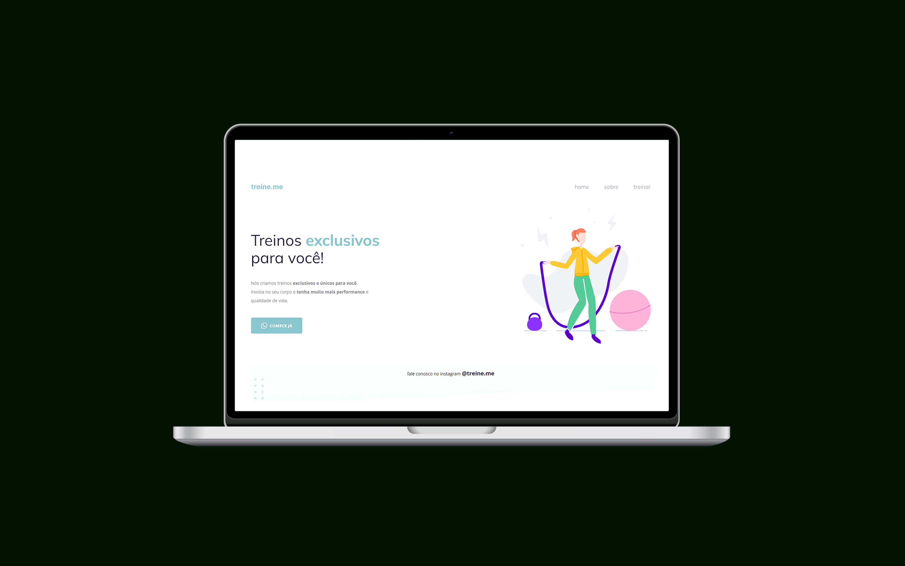

<h1 align="center">Desafio de Correção</h1>

  

  

## 💻 Projeto

Desafio de Correção de Layout da Rocktseat

- [Acesse o projeto]()

## 🚀 Tecnologias

Esse projeto foi desenvolvido com as seguintes tecnologias:

- HTML e CSS
- Git e Github
- Figma